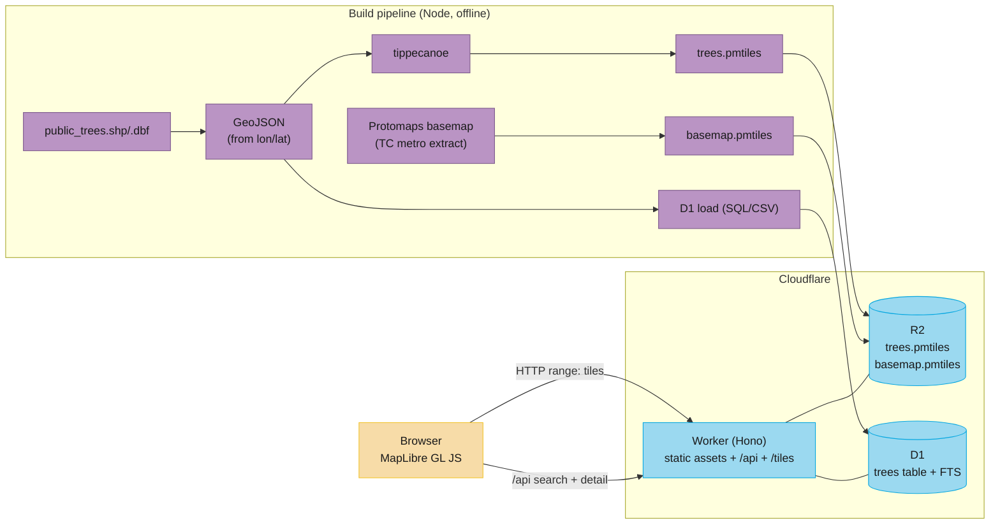

# Saint Paul Boulevard Trees — Web App Spec (v1)

> Status: Draft for build-out. Owner: bkennedy. Last updated: 2026-06-14.

## 1. Summary

A fast, public web map that lets non-technical users explore Saint Paul's public
boulevard trees. Users see trees as icons on a map, click a tree to read a few key
details, search and filter the collection, and toggle layers on/off. The visual design
evokes a **scientific botanical plate on vellum paper** — warm, calm, precise.

The app is hosted entirely on **Cloudflare** (Workers + R2 + D1) and is architected
**static-first** for speed: the heavy data is pre-baked into vector tiles, and the
database is used only for search and full-record lookups, never for rendering.

## 2. Goals & non-goals

### Product goals
- Non-technical users view ~167k trees as icons on a map.
- Click a tree → popup with a few relevant fields (start with 4).
- Toggle layers on/off; new layers can be added over time without re-architecting.
- Search and filter the tree collection (by species, ward, condition; text search by
  address/species).
- As fast as possible on desktop **and** mobile.
- Scientific / vellum-paper aesthetic.

### Non-goals (v1)
- **Raster basemap tiles** — deferred to v2 (the v1 basemap is fully vector).
- **Custom per-species icons** — v1 uses a single styled marker; per-species icons are v2.
- Editing/contributing data, user accounts, or auth — the app is read-only and public.
- Server-side spatial analysis in the app (that lives in `scripts/`, offline).

## 3. Source data (ground truth)

| Layer | Features | Geometry | Native CRS | Notes |
|-------|---------:|----------|------------|-------|
| Boulevard trees (`public_trees`) | 167,191 | Point | Ramsey County ft (custom LCC) | **Already carries `latitude`/`longitude` columns** → no reprojection needed for web. 50 attributes. |
| Metro road centerlines (`RoadCenterline`) | 201,828 | Line | NAD83 UTM 15N (EPSG:26915) | Metro-wide (7 counties). Only needed if we add a streets layer; would be clipped to Saint Paul. |

### Key tree attributes (of 50)
| Column | Meaning | Use in app |
|--------|---------|-----------|
| `uniqueid` / `site_id` | Stable identifiers | Feature `id` (primary key) |
| `SPP_com` | Species — common name | Popup title, search, filter |
| `SPP_bot` | Species — botanical name | Search, detail drawer |
| `Condition` | Condition rating | Popup, filter |
| `DBH` | Trunk diameter at breast height (in) | Popup |
| `YRPlant` | Year planted | Popup |
| `Ward` | City ward | Filter |
| `Status` | Active/inactive status | Filter (likely default to active only) |
| `address`, `street` | Street address | Search, detail drawer |
| `longitude`, `latitude` | WGS84 coordinates | Geometry source for tiles & D1 |

> **CRS note:** The web app works entirely in WGS84 (EPSG:4326) → Web Mercator
> (EPSG:3857, MapLibre's native projection). We build geometry from the `longitude`/
> `latitude` columns, **not** the projected `.shp` geometry. EPSG:26915 only matters for
> offline analysis in `scripts/`. A build-time check must confirm `longitude`/`latitude`
> are valid WGS84 and within the Saint Paul bounding box.

## 4. Architecture

Static-first. Tiles render the data; D1 answers questions about it.



### Why this shape
- **PMTiles on R2** — a single static file per layer, served via HTTP range requests.
  No tile server to run, scales to millions of points, near-zero cost at rest. The trees'
  popup + filter fields are baked into the tiles, so the common interactions need **no
  API calls**.
- **D1** — relational store for the full 50-field records and full-text search. Queried
  only on explicit search or "see full details," keeping it off the hot path.
- **One Worker** — serves the static frontend (Workers Static Assets), the `/api/*`
  routes (Hono), and a `/tiles/*` range-proxy to R2. Single deploy, single domain, all
  bindings in one place.

## 5. Data pipeline (`scripts/`)

A reproducible Node pipeline regenerates everything from the raw shapefile. Run on each
**periodic snapshot** (the chosen update model). Steps:

1. **`scripts/extract.mjs`** — read `public_trees.shp/.dbf` with the `shapefile` npm
   package; emit newline-delimited GeoJSON using `[longitude, latitude]` for geometry and
   a normalized property set (`id, spp_com, spp_bot, dbh, condition, yr_plant, ward,
   status, address`). Validate coordinates fall within the Saint Paul bbox; report drops.
2. **`scripts/build-tiles.mjs`** — invoke **tippecanoe** to produce `trees.pmtiles`:
   - Layer name `trees`; include only popup/filter fields to keep tiles small.
   - `-zg` (auto max zoom) with `--drop-densest-as-needed` so city-wide zooms thin
     gracefully instead of rendering all 167k at once.
   - Preserve a stable feature `id` (`--use-attribute-for-id=id`) for click/identify.
3. **`scripts/load-d1.mjs`** — generate `INSERT`/CSV and load via
   `wrangler d1 execute` (or `d1 import`); rebuild the FTS index.
4. **`scripts/build-basemap.mjs`** (one-time-ish) — produce a vellum-styled Protomaps
   basemap PMTiles for the Twin Cities extent.
5. **`scripts/upload-r2.mjs`** — push `*.pmtiles` to R2 via `wrangler r2 object put`.

Build artifacts (`*.geojson`, `*.pmtiles`) are written to `data/processed/` and are
**git-ignored** (re-derivable). `tippecanoe` is a native dep — install via Homebrew
(`brew install tippecanoe`); document in `scripts/README.md`.

## 6. Data model

### 6.1 Vector tile schema (`trees` layer in `trees.pmtiles`)
Minimal, to keep tiles small and interactions instant:
```
id        (string)   -- stable feature id
spp_com   (string)   -- popup title + filter
condition (string)   -- popup + filter
dbh       (number)   -- popup
yr_plant  (number)   -- popup
ward      (string)   -- filter
```

### 6.2 D1 schema (full records + search)
```sql
CREATE TABLE trees (
  id         TEXT PRIMARY KEY,   -- uniqueid (fallback site_id)
  spp_com    TEXT,
  spp_bot    TEXT,
  dbh        REAL,
  condition  TEXT,
  yr_plant   INTEGER,
  ward       TEXT,
  status     TEXT,
  address    TEXT,
  street     TEXT,
  lon        REAL NOT NULL,
  lat        REAL NOT NULL
  -- extend with more of the 50 columns as needs emerge
);

CREATE INDEX idx_trees_spp       ON trees(spp_com);
CREATE INDEX idx_trees_ward      ON trees(ward);
CREATE INDEX idx_trees_condition ON trees(condition);

-- Full-text search over the human-searchable fields
CREATE VIRTUAL TABLE trees_fts USING fts5(
  id UNINDEXED, spp_com, spp_bot, address, content='trees'
);
```

## 7. API (Worker, Hono)

JSON, read-only, cacheable. All responses set `Cache-Control` appropriate to the
snapshot cadence (long max-age + versioned via a data build id).

| Method & path | Purpose | Response |
|---------------|---------|----------|
| `GET /api/health` | Liveness | `{ ok, buildId }` |
| `GET /api/facets` | Distinct values for filter UIs | `{ species[], wards[], conditions[] }` (cached) |
| `GET /api/search?q=&species=&ward=&condition=&limit=` | Text + faceted search | `[{ id, spp_com, address, lon, lat }]` |
| `GET /api/trees/:id` | Full record for the detail drawer | `{ ...all stored fields }` |
| `GET /tiles/:file` | Range-proxy PMTiles from R2 | `206 Partial Content` |

Search returns coordinates so the client can fly-to and highlight. Heavy filtering of the
**visible** map is done client-side via MapLibre `setFilter` on the in-tile fields (no API
call); D1 search is for "find me X anywhere in the city."

## 8. Frontend

### 8.1 Stack
- **MapLibre GL JS** + `pmtiles` protocol plugin (reads PMTiles over HTTP range).
- **Vite + TypeScript**, no heavy UI framework — a lean SPA for fast first paint. (A small
  framework can be added later if the UI grows; not needed for v1.)
- Served as static assets by the same Worker (Workers Static Assets).

### 8.2 Layers & toggling
- Layer registry is **config-driven** (a small JSON/TS array describing each layer: id,
  source, style, label, default visibility). Adding a future layer = add an entry + its
  PMTiles; the layer panel renders from the registry. This satisfies "layers I add later."
- v1 layers: **Vellum basemap** (vector) and **Trees**. Streets come from the basemap.

### 8.3 Tree rendering
- Symbol/circle layer from the `trees` PMTiles source.
- City-wide zoom: thinned points (via tippecanoe) so the map never chokes.
- Zoom-dependent marker size; single sepia marker glyph in v1 (per-species icons in v2).
- Optional: subtle color encoding by `condition` (configurable, off by default to keep the
  plate calm).

### 8.4 Popup (on click)
A botanical-specimen-card popup with the four chosen fields:
1. **Species (common name)** — title.
2. **Condition**
3. **Trunk diameter (DBH)** — inches.
4. **Year planted**

A "Full details" affordance calls `GET /api/trees/:id` and opens a side drawer with the
complete record (future-friendly as we surface more of the 50 fields).

### 8.5 Search & filter UI
- Search box (address / species) → `/api/search`, results list, click to fly-to + highlight.
- Filter chips/dropdowns for species, ward, condition (populated by `/api/facets`) → apply
  client-side `setFilter` for instant visible-map filtering.

### 8.6 Responsive
- Desktop: map + collapsible left panel (layers/filters) + right detail drawer.
- Mobile: full-bleed map; layers/filters and details in bottom sheets; large tap targets.

### 8.7 Design system — "scientific vellum"
- **Background:** warm cream paper (~`#F2E9D2`) with a very subtle grain/noise texture.
- **Ink:** dark sepia-brown text (~`#3A3026`); hairline rules like an engraving.
- **Accents:** muted sage green for trees, restrained use of the brand palette for UI
  states (primary `#06A7E0` used sparingly for interactive focus).
- **Type:** a serif for headings (journal feel, e.g. Spectral / Libre Baskerville) + a
  clean sans for data (e.g. Inter).
- **Basemap style:** Protomaps basemap recolored to sepia/cream — muted roads, soft water,
  parks as pale washes — so trees read as the focal specimens on the plate.

## 9. Performance strategy
- Static PMTiles over R2 range requests; no origin compute on the render path.
- Only popup/filter fields in tiles → small tiles, fast paint, instant interactions.
- Long-cache immutable assets and tiles; bust via a `buildId` in paths/query on each
  snapshot.
- Lazy-load the detail drawer data (D1) only on demand.
- Target budgets: first meaningful map < ~1.5 s on broadband desktop; smooth pan/zoom on a
  mid-range phone; no single network payload that blocks first paint.

## 10. Repository layout (additions)
```
stpaul-trees/
├── app/                  # Vite + MapLibre frontend (SPA)
│   ├── src/
│   └── index.html
├── worker/               # Cloudflare Worker (Hono): /api, /tiles, static assets
│   └── src/
├── scripts/              # Build pipeline (extract → tiles → D1 → upload)
├── data/
│   ├── raw/              # source shapefiles (git-ignored)
│   └── processed/        # geojson + *.pmtiles build artifacts (git-ignored)
├── outputs/              # offline map exports (git-ignored)
├── wrangler.toml         # Worker + R2 + D1 bindings
├── qgis/                 # QGIS desktop project (see qgis/README.md)
│   ├── stpaul_trees.qgz
│   └── styles/           # QGIS .qml layer styles
└── docs/SPEC.md          # this file
```

## 11. Tech stack & dependencies
- **Runtime/build:** Node LTS via **Bun** where possible; native `tippecanoe` (Homebrew).
- **Frontend:** `maplibre-gl`, `pmtiles`, Vite, TypeScript.
- **Worker:** `hono`, `wrangler`; bindings for R2 (`TILES`) and D1 (`DB`).
- **Pipeline:** `shapefile` (read shp/dbf), `@turf/*` (optional bbox checks), tippecanoe.
- **Cloudflare:** Workers (Static Assets), R2, D1.

## 12. Roadmap
- **v1 (this spec):** vector basemap, trees layer, 4-field popup, full search + filter,
  layer toggles, vellum design, periodic-snapshot pipeline.
- **v2:** raster basemap tile option; custom per-species icons; richer detail drawer;
  possibly the streets layer as a standalone toggle; clustering at low zoom if desired.

## 13. Open questions / to confirm during build
1. **Primary key:** confirm `uniqueid` is unique and stable across snapshots (else use
   `site_id`). Affects tile `id` and D1 PK.
2. **Coordinate validity:** verify `longitude`/`latitude` are WGS84 and inside the Saint
   Paul bbox (the `.shp` is in Ramsey County feet; the lat/lon columns are what we trust).
3. **`Status` filtering:** should inactive/removed trees be excluded by default?
4. **Domain & deploy:** target hostname, and Workers Static Assets vs. Pages (spec assumes
   Workers Static Assets for unified bindings).
5. **Basemap extent/source:** confirm Protomaps Twin Cities extract is acceptable and the
   licensing/attribution placement (OSM/Protomaps attribution in the UI).
6. **Snapshot cadence & trigger:** manual `npm run build && deploy`, or scheduled?
```
